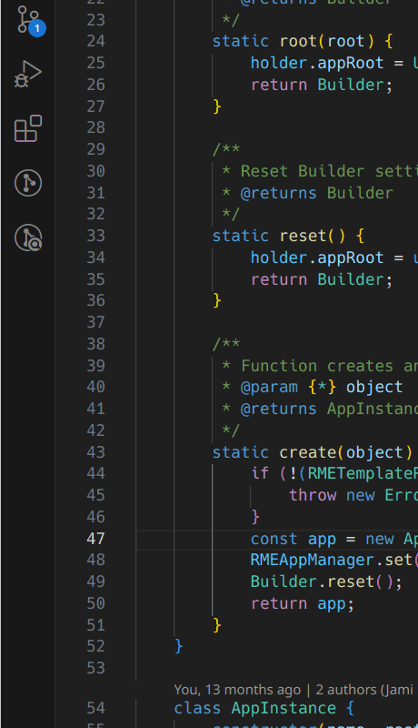
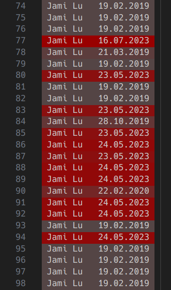

# SB - Simply Blame

Idea like git blame annotations for VS Code!

## Steps to use
1. Install the extension
2. Press **Alt + B** on the text editor
3. You will see who to blame

### Screenshots

## Settings
 * Enable/disable a command to open a blame file in a new text editor tab, disabled by default.
    * The enabled command will show up on the context menu of the active text editor tab.
 * Configure and change colors of a heat map color scheme. Top being hot and bottom being cool.
    * Dark and Light theme is supported. Both theme colors are editable.
 * Change blame date format.
    * System will use the locale used by the VS Code.
    * Or you can choose other pre existing date formats.

#### Change of the settings require a restart of the VS Code.

### How to find extension settigns

