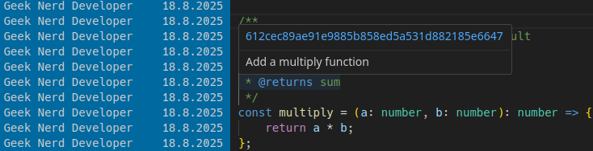

# SB - Simply Blame 

Idea like git blame annotations for VS Code!

Git blame annotations on the text editor just like in Jet Brains IntelliJ Idea and other familiar code editors. Simply Blame is comprehensively configurable with various settings from date formats, author formats, heat map colors and other settings. Simply Blame is made for VS Code and other VSIX extension compatible code editors.

## Steps to use
1. Install the extension
2. Press **Alt + B** on the text editor
3. You will see who to blame

## Key features
 * Fully customizable heat colors use rgb or hex, choose coloring strategy
 * Flexible output options: multiple date formats, author styles
 * Configurable hover box: appearance and action for the commit hash

## Install
 * [VS Code Marketplace](https://marketplace.visualstudio.com/items?itemName=JamiTech.simply-blame) **or** [Open VSX Registry](https://open-vsx.org/extension/JamiTech/simply-blame)

## Screenshots

**You can choose the hash action from the extension settings that will be invoked when the hash is clicked**

**A minimal details box is an alternative to the normal which displays full details. The minimal details box shows only the commit summary**

## Settings
 * **Date Format**
   * System will use the locale used by the VS Code.
   * Or you can choose any other pre existing date format to use.
* **Author Style**
   * Select an author style for the blame annotations. Supported styles are full name, first name, last name.
* **Hover Style**
   * Select a blame annotation hover detail box style. Options are normal and minimal.
* **Hash Action**
   * Select an action to be invoked when the commit hash is clicked on the hover box. Supported actions are copy to clipboard and open in browser.
* **Heat Color Index Strategy**
   * Choose how the heat colors are shown. Scale through the commits, this is the default or highlight the latest commits.
* **Keep Blames Open**
   * Keep blame annotations open as long as a tab or window is open. If not selected annotations are closed on tab change.
* **Use RGBColor**
   * If selected the RGBColors dark and light lists are used. This is the default.
   * Otherwise the hex color list will be used.
* **Heat Map RGBColors List Dark** & **Heat Map RGBColors List Light**
   * Add, edit, choose a color to be used as a heat color.
   * Color must in format rNUM,gNUM,bNUM,cNUM
   * Choose a color by setting it as true. The first matching true will be used or if nothing is matching the first is used.
* **Heat Map Colors Dark** & **Heat Map Colors Light**
   * Configure and change colors of the heat map hex color list.
   * The top is hot and the bottom is cool.
* **Enable Open Blame Editor** *This setting is likely to be removed in future releases*
   * Select to enable a command to open a blame file in a new text editor tab, disabled by default.
   * The enabled command will show up on the context menu of the active text editor tab.

### How to find extension settings

